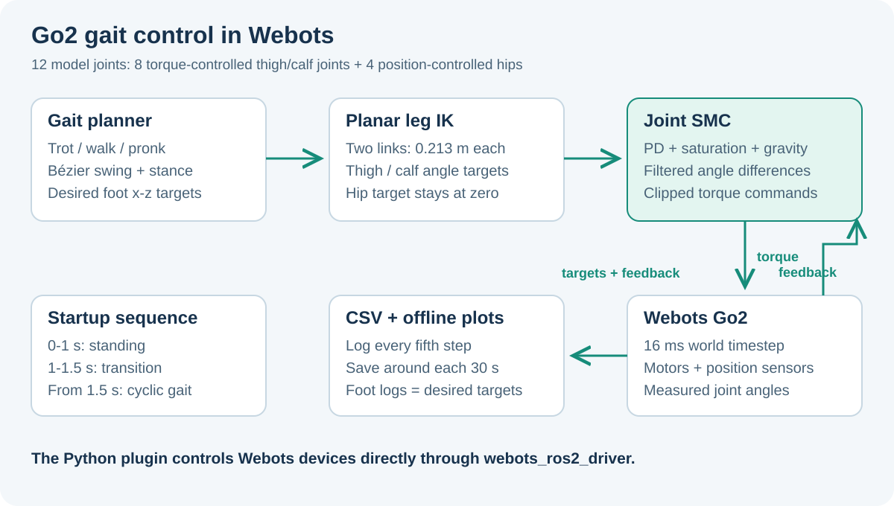

# Unitree Go2 - ROS 2 + Webots Gait Control

Joint torque control, planar leg kinematics, and gait logging for the Unitree Go2 model in Webots.

[English](#english) | [Tiếng Việt](#tieng-viet)



<a id="english"></a>

## English

This repository connects a Webots Go2 model to a Python `webots_ros2_driver` plugin. It generates foot trajectories for `trot`, `walk`, or `pronk`, converts them to thigh/calf targets, and compares position control with a sliding mode controller (SMC) that includes analytical gravity compensation.

The model has 12 actuated joints. **SMC drives the eight thigh and calf joints; the four hip joints stay at a position target of zero.** This is a simulation control project. The repository does not contain a physical Go2 transport or deployment workflow.

### What is implemented

- Fourth-order Bézier swing trajectories and linear stance trajectories, with per-leg gait phase offsets.
- Two-link inverse and forward kinematics in each leg's x-z plane.
- Joint SMC with separate thigh/calf gains, filtered finite-difference velocities, a saturation boundary layer, and torque clipping.
- A standing phase, a transition into the gait, then continuous cyclic motion.
- CSV recording and Matplotlib plots for tracking error, commanded torque, sliding surface, and desired foot trajectories.
- Optional Pinocchio dynamics output for monitoring. It does not supply the controller's gravity compensation.

### Repository map

| Path | Purpose |
| --- | --- |
| [control.launch.py](ros2_ws/src/go2_control/launch/control.launch.py) | Opens Webots and attaches the controller to `Go2Description` |
| [smc_plugin.py](ros2_ws/src/go2_control/go2_control/smc_plugin.py) | Device discovery, startup phases, control mode, logging |
| [smc_controller.py](ros2_ws/src/go2_control/go2_control/smc_controller.py) | Single-joint and multi-joint SMC |
| [gait_planner.py](ros2_ws/src/go2_control/go2_control/gait_planner.py) | Gait timing and foot targets |
| [go2_kinematics.py](ros2_ws/src/go2_control/go2_control/go2_kinematics.py) | Planar kinematics and gravity torque model |
| [data_logger.py](ros2_ws/src/go2_control/go2_control/data_logger.py) | In-memory recording and CSV export |
| [plot_results.py](ros2_ws/src/go2_control/go2_control/plot_results.py) | Offline plots |
| [empty.wbt](ros2_ws/src/go2_description/worlds/empty.wbt) | Webots world, 16 ms basic timestep |
| [Go2Description.proto](ros2_ws/src/go2_description/protos/Go2Description.proto) | Motors, position sensors, geometry, and physics |
| [go2_description](ros2_ws/src/go2_description) | URDF, xacro, mesh assets, and inherited reference configurations |

### Environment

The existing project targets Ubuntu 22.04 and ROS 2 Humble. The checked-in world uses the Webots `R2025a` format and remote Cyberbotics background/floor PROTO references.

Prepare these tools before building:

| Dependency | Use |
| --- | --- |
| ROS 2 Humble and `colcon` | Build and launch the two ROS packages |
| Webots, with `webots` on `PATH` | Simulator executable used directly by the launch file |
| `webots_ros2_driver` | External controller connection and Python plugin |
| `ament_cmake`, `urdf`, `xacro` | Description package build dependencies |
| Python 3, NumPy | Controller calculations; NumPy is listed in `setup.py` |
| Matplotlib | Offline plotting; install separately if unavailable |
| Pinocchio, optional | Dynamics monitoring only |

The package manifests also declare `robot_state_publisher` and `rviz2` for the description package. No exact dependency lockfile is provided.

### Build and run

Clone the repository and build from its **nested `ros2_ws`**, which already contains both packages:

```bash
git clone https://github.com/TuanLinh05/ROS2_Webots_DOG.git
cd ROS2_Webots_DOG/ros2_ws
source /opt/ros/humble/setup.bash

# Resolve declared ROS dependencies in an initialized rosdep environment.
rosdep install --from-paths src --ignore-src -r -y
colcon build --packages-select go2_description go2_control
source install/setup.bash

ros2 launch go2_control control.launch.py
```

The launch file starts `webots <installed-world-path>`, then attaches `go2_control.smc_plugin.SMCControllerPlugin` using `WebotsController`. The world sets the robot controller to `<extern>` and the launch expects the exact robot name `Go2Description`. Closing Webots shuts down the ROS launch.

To open the world without attaching the SMC plugin:

```bash
ros2 launch go2_description webots.launch.py
```

The description-only launch is useful for inspecting the model, but it does not run the gait controller.

### Control defaults

Change these source constants in `smc_plugin.py`, rebuild, and restart the launch. They are **not ROS launch arguments or declared runtime parameters**.

| Setting | Default | Meaning |
| --- | --- | --- |
| `CONTROL_MODE` | `'smc'` | `'smc'` torque mode or `'position'` motor position targets |
| `GAIT_TYPE` | `'trot'` | `'trot'`, `'walk'`, or `'pronk'` |
| `ENABLE_LOGGING` | `True` | CSV recording enabled |
| `freq` | `2.5` Hz | Gait cycle frequency |
| `stride_length` | `0.10` m | Desired stride length |
| `swing_height` | `0.05` m | Desired swing lift |
| `default_z` | `-0.28` m | Nominal foot height relative to the planar leg frame |

Startup follows simulation time:

1. `0-1.0 s`: stand using position targets.
2. `1.0-1.5 s`: transition toward the initial gait targets and initialize SMC history.
3. From `1.5 s`: apply cyclic targets; in SMC mode, switch thigh/calf motors to torque control.

The controller takes `dt` from the world's basic timestep. At 16 ms, it updates once per simulation step, nominally 62.5 Hz in simulation time. This is not a measured host processing rate.

For each driven joint:

```text
e   = q_des - q_act
s   = de + Lambda * e
tau = clip(G(q) + K_p*e + K_d*de + K_smc*clip(s/Phi, -1, 1))
```

Desired and measured velocities use exponential smoothing; velocity error is limited to ±10 rad/s before computing torque. The thigh/calf torque limits in the plugin match the corresponding PROTO limits, 23.7 and 45.43 N·m. These are model configuration values, not measured actuator capability.

### Logs and plots

The logger defaults to **`~/ros2_ws/logs`**, regardless of the clone location. It records every fifth simulation step after the startup phases and calls `save()` around each 30 s of simulation time.

```bash
# From the repository's ros2_ws directory:
python3 src/go2_control/go2_control/plot_results.py
python3 src/go2_control/go2_control/plot_results.py ~/ros2_ws/logs/smc_log_TIMESTAMP.csv

# Installed console entry point:
ros2 run go2_control plot_results
```

CSV columns include `time`, `gait`, joint `_des`, `_act`, `_err`, `_tau`, `_s`, and per-leg `_foot_x` / `_foot_z`. The default joint plots show the front-left thigh/calf; the foot plot shows all four legs.

**Interpretation:** foot columns are desired gait targets, not measured contact trajectories. Torque columns are commands. In position mode, torque and sliding-surface columns are absent. Each save exports the accumulated buffer; the plugin does not register a final save on shutdown, so a short run may produce no CSV.

### Troubleshooting and limits

| Symptom | Check |
| --- | --- |
| `webots` cannot be launched | Confirm the Webots executable is on `PATH` in the same shell |
| ROS cannot find a package | Build from `ros2_ws` and source `install/setup.bash` in that shell |
| Model loads but no plugin motion | Use `go2_control control.launch.py`; check `Go2Description` and `<extern>` |
| Missing motor/sensor or no torque | Names must match `FL/FR/RL/RR_*_joint` and `<joint>_sensor` in the PROTO |
| Plotter finds no CSV | Check `~/ros2_ws/logs`; allow a scheduled save, or pass an explicit CSV path |
| Pinocchio never loads | Its optional URDF lookup is hard-coded to `~/ros2_ws/src/go2_description/urdf/go2_description.urdf` |

The controller uses planar leg motion and a simplified analytical gravity model. It does not implement body attitude stabilization, navigation, terrain perception, or physical robot communication. The retained Gazebo YAML and `.launch` files are inherited ROS 1 references; they are not the active ROS 2 Webots control path. Simulation results need their world, timestep, mode, and gains recorded for meaningful comparison.

### Credits and related work

The Go2 description is based on [Unitree's Go2 URDF](https://github.com/unitreerobotics/go2_urdf). The package keeps its [upstream-style reference README](ros2_ws/src/go2_description/README.md). `go2_description/package.xml` declares BSD, while `go2_control/package.xml` still has a TODO license declaration; do not infer a complete repository license from one package.

Author: [Vu Tuan Linh](https://github.com/TuanLinh05), HCMUT. Related project: [Quadruped-robot-12DOF](https://github.com/TuanLinh05/Quadruped-robot-12DOF).

<a id="tieng-viet"></a>

## Tiếng Việt

Repo điều khiển mô hình Unitree Go2 trong Webots bằng plugin Python của `webots_ros2_driver`. Bộ lập dáng đi tạo quỹ đạo bàn chân `trot`, `walk`, `pronk`; động học ngược đổi quỹ đạo thành góc đùi/gối; bộ SMC có bù trọng lực tạo mô-men điều khiển.

Mô hình có 12 khớp, nhưng **chỉ 8 khớp đùi/gối dùng SMC**. Bốn khớp hông giữ góc 0 bằng điều khiển vị trí. Repo phục vụ mô phỏng, chưa có giao tiếp hoặc quy trình triển khai lên Go2 thật.

### Chuẩn bị và khởi chạy

- Môi trường gốc: Ubuntu 22.04, ROS 2 Humble, Webots và `webots_ros2_driver`.
- World/PROTO dùng định dạng `R2025a`; các PROTO nền/sàn tham chiếu đến nguồn Cyberbotics qua mạng.
- Cần `colcon`, các gói ROS trong `package.xml`, Python 3 và NumPy. Matplotlib dùng để vẽ log; Pinocchio là tùy chọn để giám sát động lực học.

Sau khi clone, chạy các lệnh trong thư mục `ROS2_Webots_DOG/ros2_ws`:

```bash
source /opt/ros/humble/setup.bash
rosdep install --from-paths src --ignore-src -r -y
colcon build --packages-select go2_description go2_control
source install/setup.bash
ros2 launch go2_control control.launch.py
```

Launch mở Webots và gắn plugin vào robot tên `Go2Description`, controller `<extern>`. Đóng Webots sẽ dừng launch. `ros2 launch go2_description webots.launch.py` chỉ mở world, không gắn bộ điều khiển dáng đi.

### Chỉnh bộ điều khiển

Sửa trực tiếp [smc_plugin.py](ros2_ws/src/go2_control/go2_control/smc_plugin.py), build lại và khởi động lại. `CONTROL_MODE`, `GAIT_TYPE`, `ENABLE_LOGGING` là hằng trong mã, không phải tham số ROS thay đổi khi chạy.

Mặc định là SMC, trot, 2.5 Hz, bước dài 0.10 m, nhấc chân 0.05 m và độ cao bàn chân -0.28 m. Một giây đầu giữ tư thế đứng, 0.5 giây tiếp theo chuyển sang dáng đi, sau 1.5 giây bắt đầu chu kỳ liên tục. Khớp hông vẫn giữ bằng position control.

SMC dùng sai số góc, sai số vận tốc đã lọc, mặt trượt và hàm bão hòa để hạn chế chattering; đầu ra được chặn theo giới hạn mô-men mô hình. Bù trọng lực lấy từ `go2_kinematics.py`; Pinocchio chỉ in dữ liệu giám sát. Bước world 16 ms tương ứng 62.5 lần cập nhật mỗi giây mô phỏng, không phải số đo hiệu năng máy tính.

### Đọc kết quả và lưu ý

Log mặc định nằm ở **`~/ros2_ws/logs`**, không phụ thuộc vị trí clone. Plugin ghi mỗi 5 bước sau giai đoạn khởi động và xuất CSV khoảng mỗi 30 giây mô phỏng. Có thể vẽ bằng `ros2 run go2_control plot_results`, hoặc truyền đường dẫn CSV cho `plot_results.py` như phần tiếng Anh.

- Góc `_act` đọc từ cảm biến khớp; `_des` là góc đặt, `_err` là sai số.
- `_tau` là mô-men lệnh, `_s` là mặt trượt; hai trường này không có trong position mode.
- `_foot_x` / `_foot_z` là quỹ đạo bàn chân **mong muốn**, không phải quỹ đạo tiếp xúc đo được.
- Chưa có callback lưu cuối phiên; dừng trước lần lưu định kỳ có thể chưa tạo CSV. Các lần lưu giữ toàn bộ bộ đệm đã tích lũy.
- Đường dẫn URDF của Pinocchio cố định ở `~/ros2_ws/src/go2_description/urdf/go2_description.urdf`.
- Các YAML Gazebo và launch ROS 1 được giữ làm tham khảo; đường chạy chính là ROS 2 + Webots.

Repo chưa có điều khiển tư thế thân, định vị, nhận biết địa hình hoặc kết nối robot thật. Khi so sánh kết quả, ghi rõ world, timestep, mode và hệ số điều khiển. Bảng cấu trúc, mặc định và cách xử lý lỗi ở phần tiếng Anh áp dụng cho cùng mã nguồn.

Mô hình Go2 dựa trên [unitreerobotics/go2_urdf](https://github.com/unitreerobotics/go2_urdf). Package mô tả khai báo BSD; package điều khiển còn TODO giấy phép. Tác giả: [Vu Tuan Linh](https://github.com/TuanLinh05), HCMUT.
